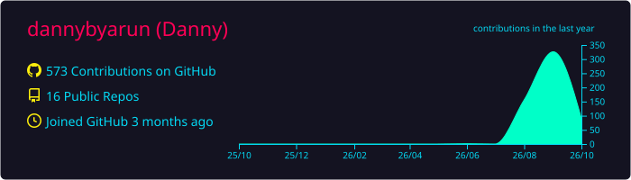
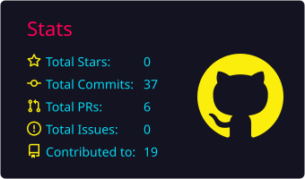
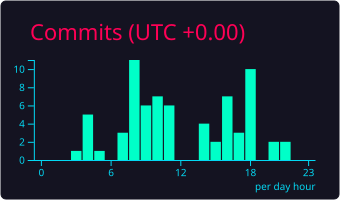
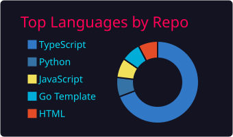
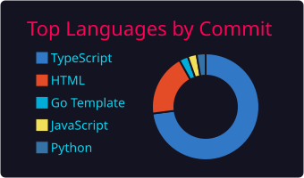

<div align="center">


[](https://github.com/dannybyarun)

[](https://github.com/dannybyarun?tab=followers)
[](https://github.com/dannybyarun?tab=repositories)


</div>

## ⚡ `whoami`

```yaml
$ whoami
name: Danny (@dannybyarun)
role: Full-Stack Developer · Web3 Builder · AI Agent Architect
location: Nepal 🇳🇵
focus: shipping fast, breaking nothing (mostly)
currently_building:
  - SajiloKhata      # 🇳🇵 digital ledger app — v1 → v4 and counting
  - wa-gateway       # self-hosted multi-session WhatsApp gateway
  - flop-reputation  # KYA — trust scores for AI agents
learning: [Solidity, Rust, "getting sleep schedule to 1.0"]
philosophy: "Talk is cheap. Ship the thing."
```

<div align="center">

</div>

## 🧬 Tech Arsenal

<div align="center">

** Languages **


** Frameworks & Infra **


</div>

## 🕹️ Featured Public Builds

| Build | What it does |
|-------|--------------|
| [**technocore-ts**](https://github.com/dannybyarun/technocore-ts) | TypeScript core of the TechnoCore agent ecosystem |
| [**technocore-mcp**](https://github.com/dannybyarun/technocore-mcp) | MCP server for the TechnoCore stack |
| [**ai-csc266-exam-pack**](https://github.com/dannybyarun/ai-csc266-exam-pack) | AI (CSC266) exam prep — curated & battle-tested |
| [**lumina-film**](https://github.com/dannybyarun/lumina-film) | Production package for *Lumina*, an AI short film |

## 🔒 Classified: Private Builds

<details>
<summary><b>🔓 decrypt the archive</b> <i>(click to expand)</i></summary>
<br>

> ⚠️ **CLEARANCE LEVEL REQUIRED** — the projects below run in stealth mode.
> *Names visible, source classified.* DM me if you want the tour.

**🧾 Fintech / Products**
- **SajiloKhata** (v1 → v4 + Next.js redesign + Play Store kit) — Nepali digital ledger (Bahi-Khata) app, shipped end-to-end 🇳🇵
- **invio** — self-hosted invoicing with SSRF-hardened template installs
- **sajilo-next-v2** — "Crimson Coral & Warm Amber" ledger UI redesign
- **fonepay-reusable** — reusable Fonepay payment integration (Nepal 🇳🇵)

**💬 WhatsApp Infrastructure**
- **wa-gateway** — self-hosted multi-session WhatsApp gateway (Baileys): REST + WebSocket + webhooks
- **openwa-worker** — WhatsApp connection layer for Cloudflare Workers (Baileys inside a Durable Object)
- **wa-shop-agent** — agentic WhatsApp shop assistant: D1 catalog/orders/customers + webhook agent layer

**⛓️ Web3 / Bots**
- **mintbot** & **mintbotbyarun** (Rust) — NFT mint automation
- **nft-sniper-bot** / **nft-auto-seller-suite** — OpenSea offers, listings & profitability with safety controls
- **agenthood** (Solidity) — autonomous-agent NFT contracts + dynamic metadata for Robinhood Chain
- **seadrop-testnet-deploy** (Solidity) — SeaDrop testnet deployments

**🤖 AI / Agents**
- **flop-reputation** (Python) — *KYA (Know Your Agent)*: trust scores for AI agents on the FLOP Network
- **ops-console** — operations console for agent fleets
- **technocore-agents** — agent orchestration scripts

**🛠️ Ops / Tooling**
- **browser-bridge** (Python, stdlib-only) — WebDriver client driving remote Firefox through a tunnel
- **vps-setup-scripts** / **socks-proxy-setup-2026** (Shell) — VPS + proxy hardening toolkits
- **compiler-case-study** — GCC vs Clang vs G++ case study, auto-built from real compiler output

</details>

## 📊 Transmission Stats

<div align="center">





<br/>



</div>

## 🐍 The Snake Ate My Commits

<picture>
  <source media="(prefers-color-scheme: dark)" srcset="https://raw.githubusercontent.com/dannybyarun/dannybyarun/output/github-snake-dark.svg" />
  
</picture>

<div align="center">

### 📡 `establish_connection`

[](https://t.me/dannybyarun)
[](https://x.com/dannybyarun)
[](mailto:byarun.danny@proton.me)


</div>
